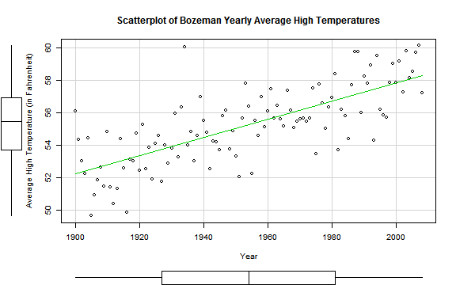
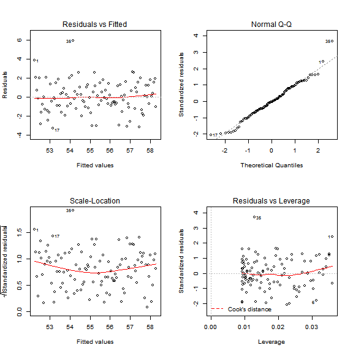

## Introduction

This activity covers performing a parametric hypothesis test for the slope coefficient in Simple Linear Regression. 

All tests will be conducted at the $\alpha = 0.05$ significance level.

--- &submitcompare1
## Bozeman Temperatures 

For over 100 years, daily minimum and maximum temperatures have been recorded at hundreds of weather stations across the US.  Climate change research involves attempting to quantify the changes over time in these sorts of records.  

For this example, the average high temperature in Bozeman, MT was calculated for 109 years from 1900 to 2008.


```r
bozemantemps <- read.csv("http://dl.dropboxusercontent.com/u/77307195/tempMV.csv")
bozemantemps$Year <- 1900:2008  ## creating a new column for year
require(car)     ## loading the car package for the scatterplot function
scatterplot(meanmax ~ Year, data = bozemantemps, smooth = FALSE, 
            main = "Scatterplot of Bozeman Yearly Average High Temperatures", 
            ylab = "Average High Temperature (in Fahrenheit)")
```



Write a couple of sentences describing this scatterplot ("Things to look for in a scatterplot" from the very beginning of Chapter 5 may be helpful).

*** .explanation
There generally looks to be an increasing linear trend in these data.  There is some year-to-year variability, but overall it looks as though there is a strong relationship present.  There does appear to be one outlier in 1934, but it does not appear to be overly influential.

--- &radio

## 1) Hypotheses

What are the appropriate hypotheses testing whether the slope coefficient is equal to 0?

1. $H_0: b_0 = 0; H_A: b_1 = 0$
2. $H_0: b_1 = 0; H_A: b_1 \neq 0$
3. $H_0: \beta_0 = 0; H_A: \beta_0 \neq 0$
4. _$H_0: \beta_1 = 0; H_A: \beta_1 \neq 0$_

*** .hint
What represents the **true** slope?

*** .explanation
$\beta_1$ denotes the true slope coefficient so we want to test to see if it is equal to zero.

--- &checkbox

## 2) Assumptions

For these data, the independence assumption is actually not met.  Aside from lurking variables, there is another reason why the years are not independent of each other.  

**Super Extra Bonus Points** if you can figure out why.

Using the diagnostic plots below and the previous information, check off all the assumptions that appear to be met.


```r
# fitting the model
temp_slr <- lm(meanmax ~ Year, data = bozemantemps)
par(mfrow = c(1,4))  ## 1 row and 4 columns of plots
plot(temp_slr)
```



```r
par(mfrow = c(1,1))  ## back to 1 row and 1 column
```

1. _Quantitative Variables_
2. _Linearity_
3. _Equal Variance_
4. _Normality_
5. _No influential points_

*** .hint
Use the description of the data to ass quantitative variables, the scatterplot to assess linearity, and the diagnostic plots for the last three.

*** .explanation
All of the assumptions appear to be met.  There is one outlier, but it is not influential so we don't need to worry too much.

--- &multitext

## 3) Test Statistic

Here is the output from the fitted model.  


```r
summary(temp_slr)
```

```
#> 
#> Call:
#> lm(formula = meanmax ~ Year, data = bozemantemps)
#> 
#> Residuals:
#>    Min     1Q Median     3Q    Max 
#> -3.285 -0.978 -0.046  1.129  5.914 
#> 
#> Coefficients:
#>              Estimate Std. Error t value Pr(>|t|)
#> (Intercept) -54.20596    9.59278   -5.65  1.3e-07
#> Year          0.05603    0.00491   11.41  < 2e-16
#> 
#> Residual standard error: 1.61 on 107 degrees of freedom
#> Multiple R-squared:  0.549,	Adjusted R-squared:  0.545 
#> F-statistic:  130 on 1 and 107 DF,  p-value: <2e-16
```

1. What is the test statistic?  Round to the nearest whole number.

*** .hint
Recall that the test statistic $= Est / SE$

*** .explanation
<span class = "answer">11</span>
We are testing the coefficient on Year so $0.056 / 0.005 \approx 11$

--- &radio

## 3) Distribution of the Test Statistic

What is the distribution of the test statistic under the null hypothesis?

1. $\chi^2(2)$
2. $\chi^2(1)$
3. $N(0,1)$
4. $t(2)$
5. $t(109)$
6. _$t(107)$_
7. $F(2,107)$
8. $F(1,107)$

*** .hint
We use a t distribution with $n-2$ degrees of freedom

*** .explanation
There are 109 years so the degrees of freedom = 109 - 2

--- &radio

## 4) P-value

What is the p-value?

1. $< 2 * e^{-16}$
2. $< 2^{-16}$
3. _$< 2 * 10^{-16}$_
4. exactly zero

*** .hint 
Recall what $< 2e-16$ means in R

*** .explanation
A p-value is never exactly zero.  The $< 2e-16$ means $< 2 * 10^{-16}$ in R.

--- &radio
## 5) Decision

What is your decision about the null hypothesis?

1. _$pvalue < \alpha \Rightarrow$ reject the null_
2. $pvalue < \alpha \Rightarrow$ fail to reject the null
3. $pvalue > \alpha \Rightarrow$ reject the null
4. $pvalue > \alpha \Rightarrow$ fail to reject the null

*** .hint
Recall that $\alpha = 0.05$.

*** .explanation
The p-value is smaller than the significance level so we reject the null.

--- &submitcompare1
## 6) Conclusion

What is your conclusion in the context of the problem?  (Just put a bunch of letters in if you are short of the 140 character limit).

*** .explanation
There is strong evidence that there is a linear relationship between Year and Average High Temperature in Bozeman, MT.

---
## Confidence intervals

We haven't talked about confidence intervals yet, but I think you can figure it out.

Recall that the formula for a confidence interval is $Est \pm t_{df}^* \times SE$ where $t_{df}^*$ was our critical value.  Use a critical value of 1.98 to make a 95% confidence interval.

---
## Other practice problems

Use the model to predict the average high temperature in 2015.  You should get about 59.

What is the $R^2$?  Interpret it in the context of the problem.


